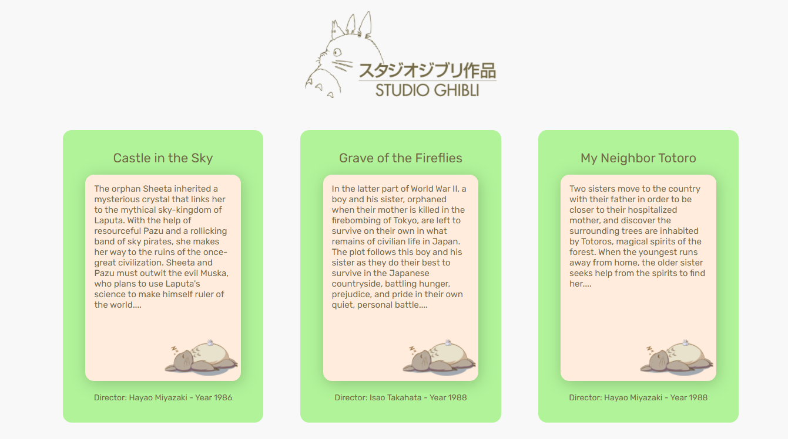
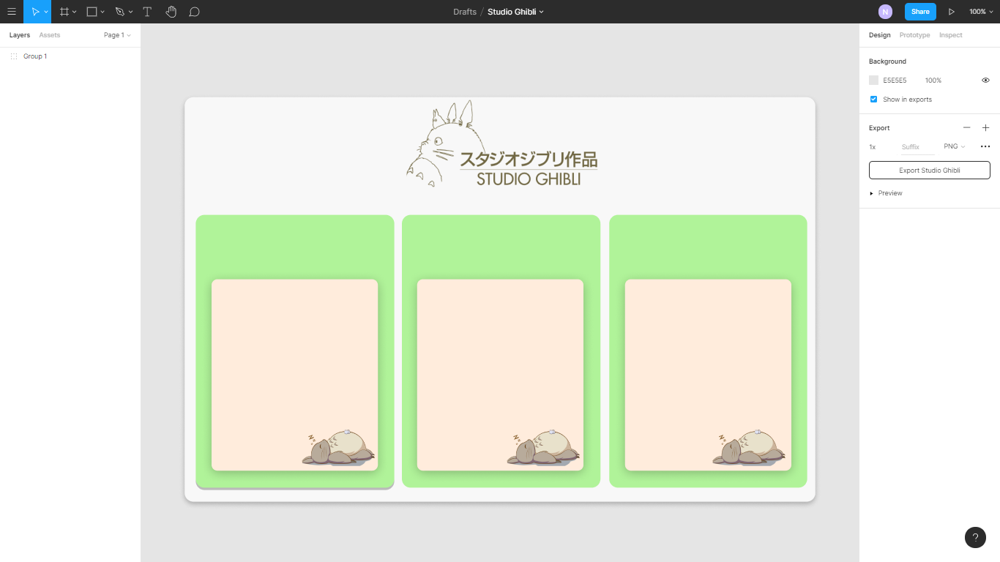

# Studio Ghibli :izakaya_lantern:

##About the Project

_Criei esse pequeno projeto __apenas__ para estudo, optei por  ultilizar a API do Studio Ghibli por ser pequena já que meu objetivo era somente entender melhor as chamadas de dados da API e métodos de array. 
No final todo o processo de criação acabou sendo muito divertido, afinal quem não gosta dos filmes do Studio Ghibli, não é mesmo?_ :smile:

>Versão inicial do projeto ainda sem a responsividade algo que pretendo implementar posteriormente.

###Protótipo

_Me preocupei em criar um protótipo do projeto, para conseguir visualizar melhor o resultado final que eu esperava alcançar._

>Protótipo criado utilizando [Figma]("https://www.figma.com/file/6bHylclCuuI9gi0NVphbqj/Studio-Ghibli?node-id=0%3A1").

####Developed by:
[Nicaely Joane]("https://github.com/Nijoane")

___
Thank you! :smile: